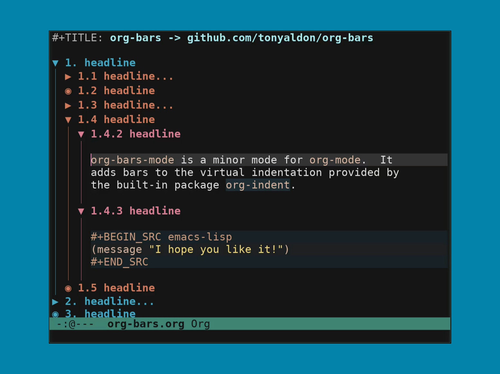

# About

`org-bars-mode` is a minor mode for `org-mode`.  It adds bars to the
virtual indentation provided by the built-in package `org-indent`.



# Install

Be sure to read the [limitations](#limitations) before trying
`org-bars`.

Put [org-bars.el](./org-bars.el) in your load path and add this to
your init file:

```elisp
(require 'org-bars)
(add-hook 'org-mode-hook #'org-bars-mode)
```

# Options

`org-bars` will respect the following org options you've already set:
1. `org-indent-indentation-per-level`,
2. `org-cycle-level-faces`,
3. `org-n-level-faces`,
4. `org-level-faces`.

If you want all the bars to have the same color, for instance
the color `#8c8c8c`, set the variable `org-bars-color-options`
like this:

```
(setq org-bars-color-options '(:only-one-color t
                               :bar-color "#8c8c8c"))
```

If you want the bars to have the same colors as the headlines
depending of outline levels (this is the default), set the
variable `org-bars-color-options` like this:

```
(setq org-bars-color-options nil)
```

You can add saturation and darkness to the bar's colors (when they
inherit the headline color) by setting the properties
`:desaturate-level-faces` and `:darken-level-faces` of the variable
`org-bars-color-options`.  For instance like this:

```
(setq org-bars-color-options '(:desaturate-level-faces 30
                               :darken-level-faces 15))
```

## Dynamic stars

If `org-bars-with-dynamic-stars-p` is set to `t` (which is the
default value) the heading stars are dynamicaly replaced by the
stars defined in `org-bars-stars` depending on the state of the
subtree.

The default heading stars are `◉` for empty headlines (`:empty`), `▶`
for folded headlines (`:invisible`) and `▼` for open headlines
(`:visible`).

If you want to modify the heading stars you can do it by modifying the
variable `org-bars-stars` as follow:

```elisp
(setq org-bars-stars '(:empty "*"
                       :invisible "+"
                       :visible "-"))
```

If you prefer the stars to have different faces than the headlines
faces, you can do it by setting the faces `org-bars-star-empty`,
`org-bars-star-invisible` and `org-bars-star-visible` as shown below:

```elisp
(custom-set-faces
 '(org-bars-star-empty ((t (:foreground "#8c8c8c"))))
 '(org-bars-star-invisible ((t (:foreground "#8c8c8c"))))
 '(org-bars-star-visible ((t (:foreground "#8c8c8c")))))
```

If you use other commands than `org-cycle` to modify the visibility of
the org tree, the stars won't be refreshed automatically.  To make
those commands refreshed the stars, you can advise them with
the function `org-bars-refresh-stars`.

If you are a user of `org-superstar` or `org-bullets` and you prefer
to keep using one of those packages over the dynamic stars of
`org-bars`, **this is possible**.

You just have to set `org-bars-with-dynamic-stars-p` to `nil` like this:

```elisp
(setq org-bars-with-dynamic-stars-p nil)
```

## Remove ellipsis

The tweak proposed here has the disadvantage to make `org-cycle`
not work correctly on items list (see: [issue #5](https://github.com/tonyaldon/org-bars/issues/5)).

This is not specific to `org-bars-mode`, but since `org-bars-mode`
update the heading stars when the visibility changes (if
`org-bars-with-dynamic-stars-p` is set to `t`), you might want to not
use the ellipsis `...` at the end of the folded headlines.

You can do this by adding this code snippet to your init file:

```elisp
(defun org-no-ellipsis-in-headlines ()
  "Remove use of ellipsis in headlines.
See `buffer-invisibility-spec'."
  (remove-from-invisibility-spec '(outline . t))
  (add-to-invisibility-spec 'outline))

(add-hook 'org-mode-hook 'org-no-ellipsis-in-headlines)
```

ps: note that you can't remove the ellipsis by setting `org-ellipsis`
variable to the empty string `""`.

## If you use differents font size for headlines

If the font size of the headlines faces (`org-level-1`, ...,
`org-level-8`) are differents from the default font size, the bars
might not be continuous.

If headlines faces are set with `face-remap-add-relative`, `org-bars`
offers no solution (see: [limitations](#limitations)).

If headlines faces are defined by your theme or with
`custom-set-faces`, you can use the variable
`org-bars-extra-pixels-height` to fill the gaps between headlines and
regular lines.

For instance, you can set `org-bars-extra-pixels-height` to `6` like
this:

```elisp
(setq org-bars-extra-pixels-height 6)
```

This will make the bars on headlines `6` pixels taller.  It seems to
fill the gaps.

The drawback is that this also increases the line height of all
the headlines but not those of the level 1 that have no added bars.

This is far for being a perfect solution.  But so far, I don't know
how to do it better.

The default value of `org-bars-extra-pixels-height` is `0` (modified
at commit: `762f6bb`).

## If your value of line-spacing is non-nil

If your value of `line-spacing` is non-nil, the bars won't be
continuous.  `org-bars` offers no solution for this case (see:
[limitations](#limitations)).

# org-bars and company-mode

If you want to use `org-bars-mode` and you are using `company-mode` to
get inbuffer code completion, you must use [company-posframe](https://github.com/tumashu/company-posframe).

Indeed, `org-bars-mode` uses images on the `line-prefix` properties
and this makes the text in the company tooltip not aligned.

`company-mode` doesn't cover this unusual case but as
`company-posframe` uses child frame as tooltip (and not overlay)
everything is ok.

# Limitations

1. `org-bars-mode` doesn't work on display that can't display images.
2. If your value of `line-spacing` is non-nil, the bars won't be
   continuous.  You'll have a gap of `line-spacing` pixels between
   each bar.  In `org-bars`, the bars are added modifying the text
   properties `line-prefix` and `wrap-prefix` on the lines of the
   buffer.  But `org-bars` doesn't touch the additional space
   (controled by `line-spacing`) put between lines when displaying
   buffer.  And I don't know how to modify/customize this space.
   Please let me know if you know how to "control" this extra
   space.
3. If you use `face-remap-add-relative` to set the faces of the
   headlines (`org-level-1`, ..., `org-level-8`), due to how the
   height of those faces is calculated to produce the XPM images put
   in the `line-prefix` and `wrap-prefix` text properties of the
   buffer, **this won't work correctly**, and the bars might not be
   continuous.
4. `org-inlinetask` seems to work but has not yet been covered properly.
